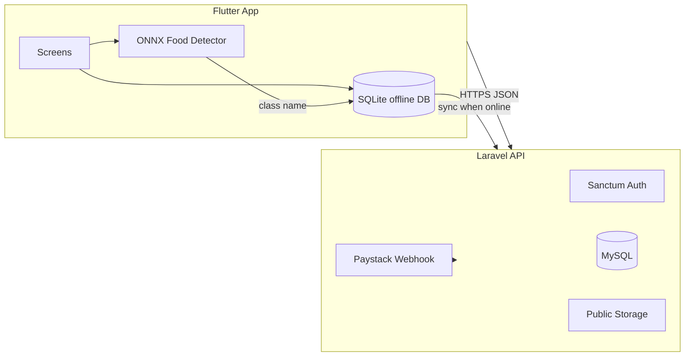

# AkwaabaFit AI

Culturally adapted fitness and nutrition app for Ghanaians. Users track activity and meals, scan local dishes with on-device AI, and book paid nutrition advice sessions with verified dietitians.

**Stack:** Laravel 12 API · Flutter mobile app · YOLOv8 food model training pipeline

## What the app is supposed to do

AkwaabaFit AI helps people in Ghana **stay active, understand what they eat, and get professional nutrition guidance** in one mobile app. It is built around local food and everyday life—not generic Western meal plans.

### For everyday users

1. **Sign up and set a health profile** — Goals, body metrics, calorie and macro targets, and preferences so the dashboard can personalize summaries.
2. **See daily wellness at a glance (Home)** — Calories eaten vs burned, step progress, weather, and short insights to stay on track.
3. **Track movement (Stride)** — Count steps with the phone, sync activity in the background, view today’s effort, and compare on a daily leaderboard.
4. **Log meals quickly (Food scanner)** — Photograph Ghanaian dishes (jollof, banku, waakye, etc.); the app detects the food on the device and logs calories and macros to **Nutrition history**. Works offline first, then syncs when online.
5. **Review eating over time (History)** — Browse meals by day with safety labels and protein / carbs / fat where available.
6. **Get expert help (Advice)** — Choose a listed dietitian, pay via Paystack, book **now** or for a **scheduled time**, then chat during the live session. Reminders fire before the session starts; chat is only open in the paid live window.
7. **Manage account (Profile)** — Update details, photo, goals, and sync data when back on the network.

### For dietitians / nutrition advisors

- **Apply in the app** — Submit Ghana Card, certificates, photo, and CV for admin review.
- **After approval** — Appear in the public list with admin-set rating and hourly rate; receive paid consultations and reply in chat (app or web advisor login).

### For administrators

- **Review applications** — Approve or reject dietitian sign-ups and set listing rating and price.
- **Oversee advice** — Access admin tools for application documents and consultation oversight.

### What the app is not trying to do (current scope)

- It does **not** replace a doctor for emergencies or clinical diagnosis.
- Food scanner macros are **reference values per dish type**, not a lab analysis of the exact portion on the plate.
- There is no social feed, wearable-only mode, or full AI-generated workout library in this version.

### Main user journeys (summary)

| I want to… | Where in the app |
|------------|------------------|
| Know if I’m on track today | **Home** |
| Record what I ate | **Scanner** → **History** |
| Walk more and see steps | **Stride** |
| Talk to a dietitian | **Advice** → pay → **chat** |
| Change my goals or photo | **Profile** |
| Become a listed dietitian | **Profile** / **Advice** → **Apply** |

## Project structure

The repository contains three main parts:

- **Backend** — Laravel API, admin web UI, Paystack webhooks, Reverb configuration
- **Mobile** — Flutter app for iOS and Android
- **AI** — Dataset merge, YOLOv8 training, ONNX export for the scanner

## What is implemented

### Mobile app (Flutter)

| Area | Details |
|------|---------|
| **Auth** | Register, login, logout, forgot / reset password, health profile onboarding |
| **Home dashboard** | Calories in/out, macro targets, weather (OpenWeather), AI insight text, quick actions |
| **Stride (fitness)** | Step tracking (pedometer), foreground/background step sync, hourly activity logs, daily leaderboard |
| **Food scanner** | On-device **YOLOv8 ONNX**; 22 Ghanaian / common dish classes; camera + gallery; confidence %; auto-log to nutrition history |
| **Nutrition** | Meal history by day, macro row (P/C/F), offline SQLite cache + server sync when online |
| **Nutrition advice** | Browse listed dietitians (photo, rating, hourly rate), book **Ask now** or **scheduled** session, Paystack checkout |
| **Advice chat** | Client + advisor chat with polling; session phases (`waiting` → `live` → `ended`); chat blocked until scheduled start; local reminders (−2h, −30m, at start) + inbox notifications |
| **Dietitian application** | In-app form: Ghana card, certificate, photo, CV, all required fields; camera/gallery for photo; status from API |
| **Profile** | Edit profile, avatar upload, goals, calorie/macro targets, sync controls |
| **Offline** | SQLite for meals, steps, nutrition food catalog cache, outbox sync |
| **Push** | Firebase Cloud Messaging device token registration |

**Main tabs:** Home · History (nutrition) · Stride · Advice · Profile

### Backend API (Laravel + Sanctum)

| Area | Endpoints / behaviour |
|------|------------------------|
| **Auth** | Register, login, logout, password reset |
| **Profile** | Show, update, avatar upload |
| **Dashboard** | Aggregates steps, meals, targets, weather |
| **Fitness** | Step sync, hourly activity, today summary, daily leaderboard |
| **Nutrition** | Log meal, history, per-class lookup, full food catalog |
| **Consultations** | Book, Paystack initiate/verify, list my sessions, messaging + delta poll, typing |
| **Payments** | Paystack webhook (signed) |
| **Dietitians** | Public listing for app; application submit + status |
| **Advisor** | Protected routes for in-app advisor role |
| **Devices** | FCM token register / unregister |
| **Broadcasting** | Client config for Reverb / Pusher-compatible WebSockets |

**Scheduled sessions:** Live window starts at scheduled time, ends at session expiry (paid + 2 hours). Messages are blocked with **402** while the session is still waiting.

### Admin & web

| URL | Purpose |
|-----|---------|
| `/admin/login` | Staff admin login |
| `/admin/dietetics/unlock` | Shared-key unlock (`DIETETICS_REVIEW_KEY` in environment) |
| `/admin/dietetics/applications` | Review pending dietitian applications; approve with **rating** + **listed hourly rate**; reject; download documents |
| `/admin/advice` | Staff view of advice chats |
| `/advisor/login` | Web login for nutrition advisors |
| `/paystack/return` | Payment return page after Paystack redirect |

Approved applications feed the mobile dietitian list (photo, rating, hourly rate from admin fields).

### AI / food recognition

| Item | Detail |
|------|--------|
| **Training** | YOLOv8 on merged Ghanaian food datasets |
| **Mobile model** | ONNX (opset 12) bundled in the app |
| **Classes (22)** | banku, beans, bread, burger, chicken, egg-pepper, fufu, hausa-koko, jollof, kelewele, kenkey, kokonte, koose, meat, nkate-cake, pasta, pizza, plantain, rice, salad, waakye, yam |
| **Nutrition lookup** | Hybrid: bundled defaults → local cache → server refresh; generic fallback if class missing |
| **Macros on scan** | Reference values per food class (not measured from plate size); detection is visual only |

### Integrations

- **Paystack** — GHS payments for nutrition advice
- **Firebase FCM** — push notifications
- **OpenWeather** — dashboard weather
- **Laravel Reverb** — WebSocket stack (optional; mobile chat uses polling + FCM)

## Architecture (high level)



## Prerequisites

### Backend

- PHP 8.2+
- Composer
- Node.js & npm (Vite assets)
- MySQL or PostgreSQL

### Mobile

- Flutter SDK 3.10+
- Android Studio / Xcode (for device builds)

### Optional (AI training)

- Python 3.10+, Ultralytics YOLOv8

## Installation on a new computer

Use this section if you received the project on a **USB drive** (or zip) instead of cloning from GitHub. You still install all dependencies on the new machine; copying source code is not enough by itself.

### Before you start (USB handoff)

**The person sending the project should copy:**

- The full project folder (backend, mobile, and AI folders).
- A **separate, secure copy** of secrets (do not post these in chat): backend environment file, Firebase Android config, Firebase iOS config, and FCM service account JSON if push is needed.
- Optional: a MySQL database export if you want the same users/meals on the new PC (otherwise you start with an empty database).

**Usually missing or unsafe to rely on after USB copy** (reinstall or recreate on the new PC):

| Item | What to do on the new computer |
|------|--------------------------------|
| PHP `vendor` folder | Run `composer install` again |
| JavaScript `node_modules` | Run `npm install` again |
| Backend environment file | Copy from sender **or** duplicate `.env.example` and fill in values |
| Flutter build cache | Run `flutter pub get` (and `flutter clean` if builds fail) |
| Database | Create empty DB and run migrations, **or** import a dump from the sender |
| Uploaded files (avatars, dietitian documents) | Copy the sender’s storage folder **or** accept empty uploads on a fresh DB |

If the USB copy included `vendor` or `node_modules` from another PC, it is often faster to **delete those folders** and reinstall with Composer/npm so binaries match your OS.

---

### Step 1 — Install required software (new PC)

Install these **before** opening the project.

| Tool | Used for | Notes |
|------|----------|--------|
| **PHP 8.2+** | Laravel API | Enable extensions: `pdo_mysql`, `mbstring`, `openssl`, `tokenizer`, `xml`, `ctype`, `json`, `fileinfo` |
| **Composer** | PHP packages | [getcomposer.org](https://getcomposer.org) |
| **Node.js 18+** and **npm** | Frontend assets | [nodejs.org](https://nodejs.org) |
| **MySQL 8** (or MariaDB) | Database | Create an empty database, e.g. `akwaabafit` |
| **Flutter 3.10+** | Mobile app | [flutter.dev](https://flutter.dev) — then run `flutter doctor` and fix anything marked ✗ |
| **Android Studio** | Android builds | SDK + emulator or a physical phone with USB debugging |
| **Git** (optional) | Version control | Not required for USB setup |

**Windows tips:** Add PHP, Composer, Node, and Flutter to your system **PATH**. Use **PowerShell** or **Command Prompt** for the commands below.

**Optional (only to retrain the food model):** Python 3.10+, then `pip install ultralytics` inside a virtual environment in the AI folder.

---

### Step 2 — Copy the project from USB

1. Plug in the USB drive and copy the whole **AkwaabaFit** project folder to a local disk (e.g. `Documents` or `htdocs`).
2. Confirm you see three main parts: **backend** (Laravel), **mobile** (Flutter), and **AI** (training scripts).
3. Place the secret files the sender gave you:
   - Backend: environment file in the Laravel root (same place as `.env.example`).
   - Mobile Android: Firebase config file in the Android app module.
   - Mobile iOS: Firebase plist in the iOS runner (if building for iPhone).

If you do **not** have a backend environment file, create one by copying `.env.example` to `.env` and filling in database name, user, password, and API keys (see [Environment variables](#environment-variables-backend)).

---

### Step 3 — Backend (Laravel API)

Open a terminal in the **backend (Laravel) folder** and run **in order**:

```bash
composer install
npm install
```

If you do not have a `.env` file yet:

```bash
copy .env.example .env
```

(On macOS/Linux use `cp .env.example .env`.)

Then:

```bash
php artisan key:generate
```

Edit `.env` on the new machine (minimum):

- `APP_URL` — URL you will use to reach the API (see below).
- `DB_DATABASE`, `DB_USERNAME`, `DB_PASSWORD` — match the MySQL database you created.
- Optional but recommended for full features: Paystack, FCM, OpenWeather, `DIETETICS_REVIEW_KEY`.

Create tables and seed food nutrition data:

```bash
php artisan migrate
php artisan db:seed
php artisan storage:link
```

Start the API:

```bash
php artisan serve
```

By default the API is at `http://127.0.0.1:8000`. JSON endpoints are under `/api` (e.g. `http://127.0.0.1:8000/api/login`).

**If the sender gave you a database dump:** create the empty database first, import the dump with MySQL tools, then run `php artisan migrate` only if needed for newer migrations.

**Optional background services:**

```bash
php artisan queue:work
php artisan reverb:start
```

Use the queue worker if push notifications or queued jobs should run locally.

**Quick check:**

```bash
php artisan test
```

All tests should pass if PHP extensions and SQLite/MySQL test config are OK.

---

### Step 4 — Mobile (Flutter app)

Open a **second** terminal in the **mobile (Flutter) folder**:

```bash
flutter doctor
flutter pub get
```

**Choose how the phone/emulator reaches your API:**

| Scenario | `API_BASE_URL` example |
|----------|-------------------------|
| Android **emulator** on same PC as API | `http://10.0.2.2:8000/api` |
| **Physical phone** on same Wi‑Fi as PC | `http://YOUR-PC-LAN-IP:8000/api` (find IP with `ipconfig` on Windows) |
| **Tunnel** (ngrok, etc.) | `https://YOUR-SUBDOMAIN.ngrok-free.dev/api` |

Run the app (replace with your URL):

```bash
flutter run --dart-define=API_BASE_URL=http://10.0.2.2:8000/api
```

For a physical device on Wi‑Fi, allow port **8000** through Windows Firewall when prompted.

The app sends an ngrok skip header for free-tier tunnels and can rewrite localhost storage URLs to match your configured API host.

**Firebase:** Without Android/iOS Firebase config from the sender, the app may still run but **push notifications will not work** until you add your own Firebase project files.

**If build fails after USB copy:**

```bash
flutter clean
flutter pub get
flutter run --dart-define=API_BASE_URL=...
```

---

### Step 5 — Optional: AI training environment

Only needed if you will **retrain** the food model, not to run the mobile scanner (the ONNX model is already bundled in the app).

1. Open a terminal in the **AI** folder.
2. Create a virtual environment and install dependencies (example):

```bash
python -m venv venv
venv\Scripts\activate
pip install ultralytics onnx
```

3. Run training scripts as documented in that folder. Datasets can be very large; they may have been omitted from the USB copy on purpose.

---

### Step 6 — Smoke test on the new PC

1. Backend running (`php artisan serve`).
2. Register a new user in the app or use an imported database account.
3. Log a meal or run the **food scanner** (camera permission).
4. Open **Advice** and confirm dietitians load (requires seeded/approved data or admin approval flow).
5. Open admin in a browser: `http://127.0.0.1:8000/admin/login` (staff user) or dietetics unlock URL with review key.

---

### Step 7 — Common USB / new-PC issues

| Problem | Fix |
|---------|-----|
| `composer` or `php` not found | Install PHP/Composer and add to PATH; restart the terminal |
| `class not found` / autoload errors | Run `composer install` in the backend folder |
| `Vite manifest not found` | Run `npm install` and `npm run build` in the backend folder |
| `SQLSTATE` / database connection | Check `.env` DB_* values; create the MySQL database |
| `No application encryption key` | Run `php artisan key:generate` |
| App shows network error on phone | Use LAN IP or tunnel URL, not `127.0.0.1`, on a physical device |
| Storage images 404 | Run `php artisan storage:link` |
| Flutter Gradle errors | Run `flutter doctor`; accept Android licenses |
| Paystack / FCM not working | Keys in `.env` are machine-specific; copy from sender or use test keys |

---

### Installing from GitHub instead

If you use Git later: clone the repository, then follow **Step 1** (tools), **Step 3** (backend), and **Step 4** (mobile) above. You still create your own `.env` and Firebase files; they are not in the repo.

## Environment variables (Backend)

| Variable | Purpose |
|----------|---------|
| `APP_URL` | Public URL (storage links, Paystack callback) |
| `PAYSTACK_PUBLIC_KEY` / `PAYSTACK_SECRET_KEY` | Payments |
| `FCM_PROJECT_ID` / `FCM_SERVICE_ACCOUNT_JSON` | Push |
| `OPENWEATHER_API_KEY` | Weather |
| `DIETETICS_REVIEW_KEY` | Unlock admin application review without staff account |
| `DIETETICS_ALLOW_SHARED_KEY` | Set `false` in production |
| `REVERB_*` | WebSocket server |
| `QUEUE_CONNECTION` | Use `database` and run a queue worker in production |

## Testing

### Backend (Pest / PHPUnit)

```bash
php artisan test
```

Feature tests cover auth, profile, dashboard, steps, nutrition history, food nutrition lookup, consultations, scheduled sessions, messaging, dietitian applications, and Paystack webhook handling.

### Mobile

```bash
flutter test
```

## CI

Backend tests run on GitHub Actions for PHP 8.3–8.5.

## Optional in-app update banner

When a newer version is on the store, the app shows a top banner with **Update** (opens Play Store / App Store) and **Dismiss** (optional updates only).

**Backend** — set in environment (then restart API):

| Variable | Purpose |
|----------|---------|
| `APP_ANDROID_LATEST_VERSION` | Newest Android version users should install (e.g. `1.0.1`) |
| `APP_ANDROID_STORE_URL` | Full Play Store link |
| `APP_IOS_LATEST_VERSION` | Newest iOS version |
| `APP_IOS_STORE_URL` | Full App Store link |
| `APP_*_MIN_VERSION` | Below this, banner cannot be dismissed (force update) |

Public check: `GET /api/app/version?platform=android&version=1.0.0` (no login).

After you publish **1.0.1** to the store, set `APP_ANDROID_LATEST_VERSION=1.0.1` on the server. Users still on **1.0.0** see the banner until they update or dismiss it.

---

## Deployment notes

The app is suitable for **beta / pilot** deployment when:

1. API is on **stable HTTPS** (not a dev ngrok URL in release builds).
2. Production environment: `APP_DEBUG=false`, migrations applied, storage linked.
3. Paystack live keys + webhook URL configured.
4. FCM and mail configured for push and password reset.
5. Android **release signing** and a proper application ID are set before store submission.

See the feature list above for scope; items like wearable sync, community challenges, and full AI workout plans are **not** implemented yet.

## API reference

JSON API routes live under `/api`. Admin and advisor pages are served as web routes on the same host.

## Roadmap / not yet built

- Public App Store / Play Store release packaging (signing, privacy policy pages)
- Portion-size estimation from scan images
- Native Reverb client on mobile (polling used today)
- Rate limiting on login/register
- Object storage (S3) for multi-server uploads
- Expanded food model classes and nutrition database

## Contributing

1. Fork the repository
2. Create a feature branch (`git checkout -b feature/your-feature`)
3. Commit your changes
4. Push and open a Pull Request

## Project team

Final year group project:

- Reginald
- Bernard
- Klenam

## Acknowledgments

- Laravel, Flutter, Ultralytics YOLOv8, ONNX Runtime
- Ghanaian food dataset contributors and open datasets used for training

## Contact

For questions or support, contact the project maintainers.
