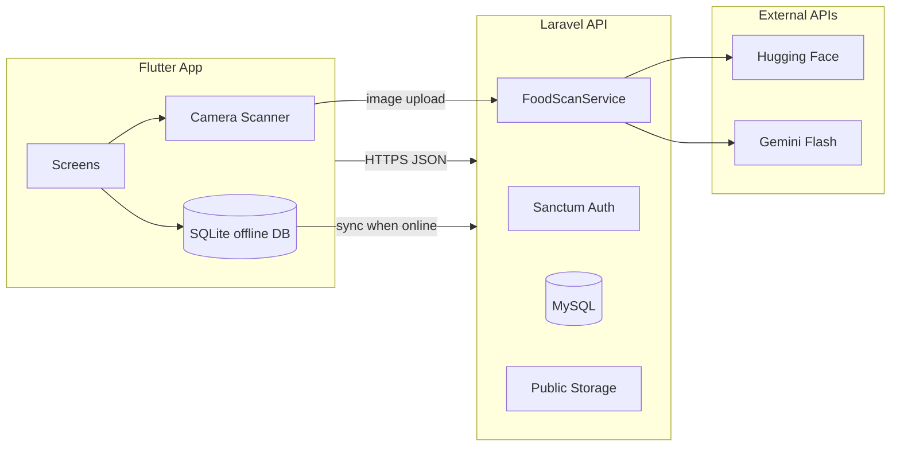

# AkwaabaFit AI

Culturally adapted fitness and nutrition app for Ghanaians. Users track activity and meals, scan local dishes with cloud-assisted AI, and manage health goals with offline-first sync.

**Stack:** Laravel 12 API · Flutter mobile app

## What the app is supposed to do

AkwaabaFit AI helps people in Ghana **stay active, understand what they eat, and monitor wellness** in one mobile app. It is built around local food and everyday life—not generic Western meal plans.

### For everyday users

1. **Sign up and set a health profile** — Goals, body metrics, calorie and macro targets, and preferences so the dashboard can personalize summaries.
2. **See daily wellness at a glance (Home)** — Calories eaten vs burned, step progress, weather, and short insights to stay on track.
3. **Track movement (Stride)** — Count steps with the phone, sync activity in the background, view today’s effort, and compare on a daily leaderboard.
4. **Log meals quickly (Food scanner)** — Photograph Ghanaian dishes (jollof, banku, waakye, etc.); the server identifies the food using a Ghana-focused model with AI fallback, then logs calories and macros to **Nutrition history**. **Requires internet** for the scan step; meal history and sync work offline-first.
5. **Review eating over time (History)** — Browse meals by day with safety labels and protein / carbs / fat where available.
6. **Stay safe outdoors (Safety)** — Weather and air-quality context with practical tips for walking and outdoor activity.
7. **Manage account (Profile)** — Update details, photo, goals, and sync data when back on the network.

### For dietitians / nutrition advisors

- **Apply via API / web portal** — Submit Ghana Card, certificates, photo, and CV for admin review (backend + admin UI).
- **After approval** — Listed in the API with admin-set rating and hourly rate; advisors can reply in chat via the **web advisor portal** (not in the mobile app today).

### For administrators

- **Review applications** — Approve or reject dietitian sign-ups and set listing rating and price.
- **Oversee advice** — Access admin tools for application documents and consultation chat oversight.

### What the app is not trying to do (current scope)

- It does **not** replace a doctor for emergencies or clinical diagnosis.
- Food scanner macros are **reference values per dish type**, not a lab analysis of the exact portion on the plate.
- **No in-app payments** — Paystack and checkout flows have been removed.
- **No telehealth tab in the mobile app** — consultation chat remains on the backend for admin/advisor web use only.
- There is no social feed, wearable-only mode, or full AI-generated workout library in this version.

### Main user journeys (summary)

| I want to… | Where in the app |
|------------|------------------|
| Know if I’m on track today | **Home** |
| Record what I ate | **Scanner** → **History** |
| Walk more and see steps | **Stride** |
| Check weather / outdoor safety | **Safety** |
| Change my goals or photo | **Profile** |

## Project structure

The repository contains two main parts:

- **Backend** — Laravel API, admin web UI, hybrid food-scan service, Reverb configuration
- **Mobile** — Flutter app for iOS and Android

## What is implemented

### Mobile app (Flutter)

| Area | Details |
|------|---------|
| **Auth** | Register, login, logout, forgot / reset password, health profile onboarding |
| **Home dashboard** | Calories in/out, macro targets, local weather (Open-Meteo + GPS), wellness insight, quick actions |
| **Stride (fitness)** | Step tracking (pedometer), foreground/background step sync, hourly activity logs, daily leaderboard |
| **Food scanner** | Full-screen camera UI + **SCAN MEAL** FAB; uploads photo to `POST /api/nutrition/scan`; macros from bundled defaults → SQLite cache → server lookup |
| **Nutrition** | Meal history by day, macro row (P/C/F), offline SQLite cache + server sync when online |
| **Safety** | Weather / air-quality hub with environment-based tips |
| **Profile** | Edit profile, avatar upload, goals, calorie/macro targets, sync controls |
| **Offline** | SQLite for meals, steps, nutrition food catalog cache, outbox sync — **scanner needs network** |
| **Notifications** | Local notifications for step goals and reminders (`flutter_local_notifications`) |

**Main tabs:** Home · History (nutrition) · Stride · Safety · Profile

### Backend API (Laravel + Sanctum)

| Area | Endpoints / behaviour |
|------|------------------------|
| **Auth** | Register, login, logout, password reset |
| **Profile** | Show, update, avatar upload |
| **Dashboard** | Aggregates steps, meals, targets, weather |
| **Fitness** | Step sync, hourly activity, today summary, daily leaderboard |
| **Nutrition** | Log meal, **scan** (hybrid HF + Gemini), history, per-class lookup, full food catalog |
| **Consultations** | Book (no payment), list my sessions, messaging + delta poll, typing — used by web advisor/admin flows |
| **Dietitians** | Public listing API; application submit + status |
| **Advisor** | Protected routes for in-app advisor role (web portal) |
| **Devices** | FCM token register / unregister (optional; mobile app does not use Firebase today) |
| **Broadcasting** | Client config for Reverb / Pusher-compatible WebSockets |

**Scheduled sessions:** Live window starts at scheduled time, ends at session expiry (booking time + 2 hours for “ask now”). Messages are blocked with **402** while the session is still waiting.

### Admin & web

| URL | Purpose |
|-----|---------|
| `/admin/login` | Staff admin login |
| `/admin/dietetics/unlock` | Shared-key unlock (`DIETETICS_REVIEW_KEY` in environment) |
| `/admin/dietetics/applications` | Review pending dietitian applications; approve with **rating** + **listed hourly rate**; reject; download documents |
| `/admin/advice` | Staff view of advice chats |
| `/advisor/login` | Web login for nutrition advisors |

Approved applications feed the public dietitian list API (photo, rating, hourly rate from admin fields).

### Food recognition (hybrid cloud scan)

| Step | Detail |
|------|--------|
| **1. Ghana model** | Hugging Face `Kennethdot/convnext_finetuned_ghanaian_food` on the uploaded image |
| **2. Gemini fallback** | If confidence is low, **Gemini 2.5 Flash** suggests dish name + macros |
| **Mobile** | Camera capture → multipart upload → display result → **LOG MEAL** |
| **Nutrition lookup** | Hybrid: bundled defaults → local SQLite cache → server refresh; generic fallback if class missing |
| **Macros on scan** | Reference values per food class (not measured from plate size); detection is visual only |

Configure in backend `.env`: `HUGGINGFACE_API_TOKEN`, `GEMINI_API_KEY` (see `.env.example`).

### Integrations

- **Hugging Face Inference** — primary Ghana food classifier for scans
- **Google Gemini** — fallback when the classifier is uncertain
- **Open-Meteo** — free local weather on device (GPS) and server; no API key
- **Laravel Reverb** — WebSocket stack (optional; mobile uses polling for any future chat features)

## Architecture (high level)



## Prerequisites

### Backend

- PHP 8.2+
- Composer
- MySQL or PostgreSQL

### Mobile

- Flutter SDK 3.10+
- Android Studio / Xcode (for device builds)

## Installation on a new computer

Use this section if you received the project on a **USB drive** (or zip) instead of cloning from GitHub. You still install all dependencies on the new machine; copying source code is not enough by itself.

### Before you start (USB handoff)

**The person sending the project should copy:**

- The full project folder (backend and mobile).
- A **separate, secure copy** of secrets (do not post these in chat): backend `.env` with database credentials and API keys.
- Optional: a MySQL database export if you want the same users/meals on the new PC (otherwise you start with an empty database).

**Usually missing or unsafe to rely on after USB copy** (reinstall or recreate on the new PC):

| Item | What to do on the new computer |
|------|--------------------------------|
| PHP `vendor` folder | Run `composer install` again |
| Backend environment file | Copy from sender **or** duplicate `.env.example` and fill in values |
| Flutter build cache | Run `flutter pub get` (and `flutter clean` if builds fail) |
| Database | Create empty DB and run migrations, **or** import a dump from the sender |
| Uploaded files (avatars, dietitian documents) | Copy the sender’s storage folder **or** accept empty uploads on a fresh DB |

If the USB copy included `vendor` from another PC, it is often faster to **delete that folder** and reinstall with Composer so binaries match your OS.

---

### Step 1 — Install required software (new PC)

Install these **before** opening the project.

| Tool | Used for | Notes |
|------|----------|--------|
| **PHP 8.2+** | Laravel API | Enable extensions: `pdo_mysql`, `mbstring`, `openssl`, `tokenizer`, `xml`, `ctype`, `json`, `fileinfo` |
| **Composer** | PHP packages | [getcomposer.org](https://getcomposer.org) |
| **MySQL 8** (or MariaDB) | Database | Create an empty database, e.g. `akwaabafit` |
| **Flutter 3.10+** | Mobile app | [flutter.dev](https://flutter.dev) — then run `flutter doctor` and fix anything marked ✗ |
| **Android Studio** | Android builds | SDK + a physical phone with USB debugging (emulators are blocked by the app) |
| **Git** (optional) | Version control | Not required for USB setup |

**Windows tips:** Add PHP, Composer, and Flutter to your system **PATH**. Use **PowerShell** or **Command Prompt** for the commands below.

---

### Step 2 — Copy the project from USB

1. Plug in the USB drive and copy the whole **AkwaabaFit** project folder to a local disk (e.g. `Documents` or `htdocs`).
2. Confirm you see **Backend** (Laravel) and **Mobile** (Flutter).
3. Place the secret files the sender gave you:
   - Backend: environment file in the Laravel root (same place as `.env.example`).

If you do **not** have a backend environment file, create one by copying `.env.example` to `.env` and filling in database name, user, password, and API keys (see [Environment variables](#environment-variables-backend)).

---

### Step 3 — Backend (Laravel API)

Open a terminal in the **Backend** folder and run **in order**:

```bash
composer install
```

If you do not have a `.env` file yet:

```bash
copy .env.example .env
```

(On macOS/Linux use `cp .env.example .env`.)

Then:

```bash
php artisan key:generate
```

Edit `.env` on the new machine (minimum):

- `APP_URL` — URL you will use to reach the API (see below).
- `DB_DATABASE`, `DB_USERNAME`, `DB_PASSWORD` — match the MySQL database you created.
- Optional but recommended: `HUGGINGFACE_API_TOKEN`, `GEMINI_API_KEY`, `DIETETICS_REVIEW_KEY`.

Create tables and seed food nutrition data:

```bash
php artisan migrate
php artisan db:seed
php artisan storage:link
```

Start the API (bind to all interfaces so phones on your Wi‑Fi can reach it):

```bash
php artisan serve --host=0.0.0.0 --port=8080
```

JSON endpoints are under `/api` (e.g. `http://127.0.0.1:8080/api/login`).

**If the sender gave you a database dump:** create the empty database first, import the dump with MySQL tools, then run `php artisan migrate` only if needed for newer migrations.

**Optional background services:**

```bash
php artisan queue:work
php artisan reverb:start
```

**Quick check:**

```bash
php artisan test
```

---

### Step 4 — Mobile (Flutter app)

Open a **second** terminal in the **Mobile** folder:

```bash
flutter doctor
flutter pub get
```

**Choose how your phone reaches your API:**

| Scenario | `API_BASE_URL` example |
|----------|-------------------------|
| **Production server** (default in app) | `https://api.tesnet.xyz/api` |
| **Physical phone** on same Wi‑Fi as PC (local dev) | `http://YOUR-PC-LAN-IP:8080/api` (find IP with `ipconfig` on Windows) |
| **Tunnel** (ngrok, etc.) | `https://YOUR-SUBDOMAIN.ngrok-free.dev/api` |

> **Note:** AkwaabaFit only runs on **real Android phones and iPhones**. Android emulators and the iOS Simulator show a blocking screen and cannot use the app.

Run on a **physical phone** (USB debugging enabled) — **production** (default API):

```bash
flutter run --release
```

Local API on your PC (phone on same Wi‑Fi):

```bash
flutter run --release --dart-define=API_BASE_URL=http://YOUR-PC-LAN-IP:8080/api
```

For a physical device on Wi‑Fi hitting your PC, allow the API port through Windows Firewall. **MySQL must be running** locally or login will fail.

Default API URL is in `Mobile/lib/shared/config/app_config.dart` (currently **https://api.tesnet.xyz/api**).

**If build fails after USB copy:**

```bash
flutter clean
flutter pub get
flutter run --dart-define=API_BASE_URL=...
```

---

### Step 5 — Smoke test on the new PC

1. Backend running (`php artisan serve --host=0.0.0.0 --port=8080`) and MySQL started.
2. Register a new user in the app or use an imported database account.
3. Run the **food scanner** (camera + network required); confirm a dish name and **LOG MEAL**.
4. Log steps on **Stride** and confirm **Home** updates after sync.
5. Open admin in a browser: `http://127.0.0.1:8080/admin/login` (staff user) or dietetics unlock URL with review key.

---

### Step 6 — Common USB / new-PC issues

| Problem | Fix |
|---------|-----|
| `composer` or `php` not found | Install PHP/Composer and add to PATH; restart the terminal |
| `class not found` / autoload errors | Run `composer install` in the Backend folder |
| `SQLSTATE` / database connection | Check `.env` DB_* values; create the MySQL database; start MySQL service |
| Login shows “Server Error” | Often MySQL stopped — start the `MySQL80` (or equivalent) service |
| `No application encryption key` | Run `php artisan key:generate` |
| App shows network error on phone | Use LAN IP or tunnel URL, not `127.0.0.1`, on a physical device |
| Storage images 404 | Run `php artisan storage:link` |
| Flutter Gradle errors | Run `flutter doctor`; accept Android licenses |
| Food scan fails | Set `HUGGINGFACE_API_TOKEN` and/or `GEMINI_API_KEY` in backend `.env` |
| Leaderboard / API timeout | Confirm app `API_BASE_URL` port matches `php artisan serve` (e.g. **8080**) |

---

### Installing from GitHub instead

If you use Git later: clone the repository, then follow **Step 1** (tools), **Step 3** (backend), and **Step 4** (mobile) above. You still create your own `.env`; it is not in the repo.

## Environment variables (Backend)

| Variable | Purpose |
|----------|---------|
| `APP_URL` | Public URL (storage links, signed portal URLs) |
| `HUGGINGFACE_API_TOKEN` | Ghana food model inference |
| `FOOD_SCAN_HF_MODEL` / `FOOD_SCAN_HF_THRESHOLD` | Classifier model and confidence cutoff |
| `GEMINI_API_KEY` / `FOOD_SCAN_GEMINI_MODEL` | Fallback dish identification |
| `WEATHER_DEFAULT_LAT` / `WEATHER_DEFAULT_LON` | Weather fallback when mobile has no GPS (default Accra) |
| `DIETETICS_REVIEW_KEY` | Unlock admin application review without staff account |
| `DIETETICS_ALLOW_SHARED_KEY` | Set `false` in production |
| `REVERB_*` | WebSocket server |
| `QUEUE_CONNECTION` | Use `database` and run a queue worker in production |
| `FCM_PROJECT_ID` / `FCM_SERVICE_ACCOUNT_JSON` | Optional push (not used by current mobile build) |

## Testing

### Backend (Pest / PHPUnit)

```bash
php artisan test
```

Feature tests cover auth, profile, dashboard, steps, nutrition history, food nutrition lookup, consultations, scheduled sessions, messaging, and dietitian applications.

### Mobile

```bash
flutter test
```

## CI

Backend tests run on GitHub Actions for PHP 8.3–8.5.

## Optional in-app update banner

When a newer version is on the store, the app shows a top banner with **Update** (opens Play Store / App Store) and **Dismiss** (optional updates only).

**Backend** — set in environment (then restart API):

| Variable | Purpose |
|----------|---------|
| `APP_ANDROID_LATEST_VERSION` | Newest Android version users should install (e.g. `1.0.1`) |
| `APP_ANDROID_STORE_URL` | Full Play Store link |
| `APP_IOS_LATEST_VERSION` | Newest iOS version |
| `APP_IOS_STORE_URL` | Full App Store link |
| `APP_*_MIN_VERSION` | Below this, banner cannot be dismissed (force update) |

Public check: `GET /api/app/version?platform=android&version=1.0.0` (no login).

After you publish **1.0.1** to the store, set `APP_ANDROID_LATEST_VERSION=1.0.1` on the server. Users still on **1.0.0** see the banner until they update or dismiss it.

---

## Deployment notes

**Production API:** [https://api.tesnet.xyz](https://api.tesnet.xyz/) — mobile app default is `https://api.tesnet.xyz/api`.

When you deploy newer code from this repo to that server, on the server run:

```bash
composer install --no-dev
php artisan migrate --force
php artisan config:cache
php artisan storage:link
```

Set in the server `.env` (not committed):

| Variable | Example |
|----------|---------|
| `APP_URL` | `https://api.tesnet.xyz` |
| `APP_DEBUG` | `false` |
| `GEMINI_API_KEY` | from [Google AI Studio](https://aistudio.google.com/apikey) |
| `HUGGINGFACE_API_TOKEN` | from [Hugging Face](https://huggingface.co/settings/tokens) |

Weather uses **Open-Meteo** (free) — no API key. Optional `WEATHER_DEFAULT_*` in `.env` for Accra fallback.

Until you deploy the latest backend, the hosted site may still be the **older GitHub version** (no Gemini dietitian, old payment routes removed locally only, etc.). Local changes only apply on the server after you pull/upload and migrate.

The app is suitable for **beta / pilot** deployment when:

1. API is on **stable HTTPS** (not a dev ngrok URL in release builds).
2. Production environment: `APP_DEBUG=false`, migrations applied, storage linked.
3. Food-scan API keys (`HUGGINGFACE_API_TOKEN`, `GEMINI_API_KEY`) configured.
4. Mail configured for password reset.
5. Android **release signing** and a proper application ID are set before store submission.

See the feature list above for scope; items like in-app telehealth, payments, wearable sync, community challenges, and full AI workout plans are **not** in the current mobile app.

## API reference

JSON API routes live under `/api`. Admin and advisor pages are served as web routes on the same host.

Key mobile endpoints:

| Method | Path | Purpose |
|--------|------|---------|
| `POST` | `/api/nutrition/scan` | Upload meal photo; hybrid food detection |
| `POST` | `/api/nutrition/log` | Log a meal (also used after scan) |
| `GET` | `/api/nutrition/history` | Meal history |
| `POST` | `/api/steps/sync` | Sync step counts |
| `GET` | `/api/leaderboard/daily` | Daily step leaderboard |

## Roadmap / not yet built

- Public App Store / Play Store release packaging (signing, privacy policy pages)
- Portion-size estimation from scan images
- Bring consultation / dietitian chat back into the mobile app (backend already supports it)
- Native Reverb client on mobile (polling used today where chat exists)
- Rate limiting on login/register
- Object storage (S3) for multi-server uploads
- Expanded food model classes and nutrition database

## Contributing

1. Fork the repository
2. Create a feature branch (`git checkout -b feature/your-feature`)
3. Commit your changes
4. Push and open a Pull Request

## Project team

Final year group project:

- Reginald
- Bernard
- Klenam

## Acknowledgments

- Laravel, Flutter, Hugging Face, Google Gemini
- Ghanaian food dataset contributors and open datasets used for model training

## Contact

For questions or support, contact the project maintainers.
